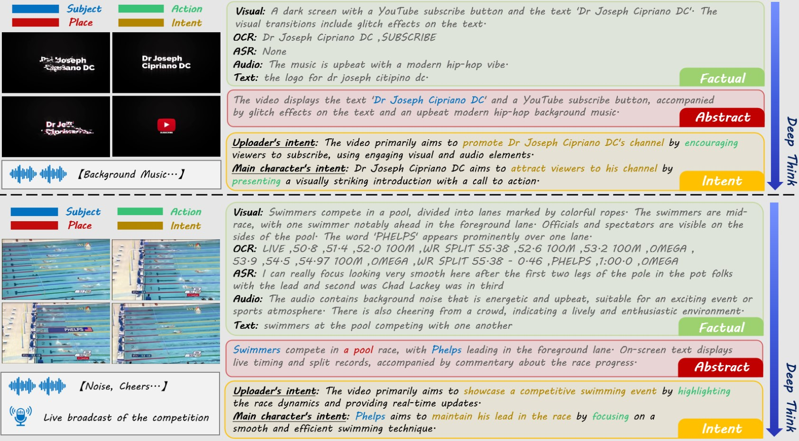
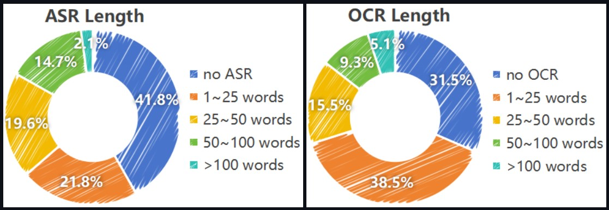
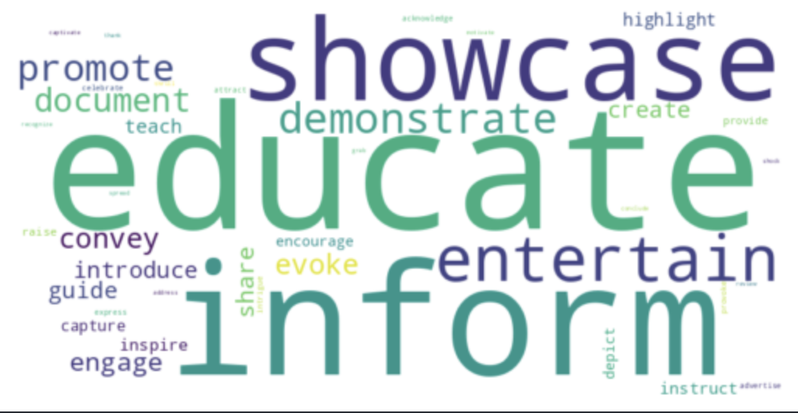
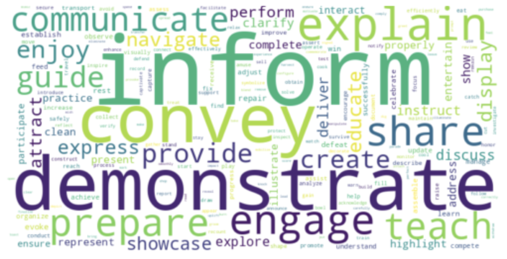

# VideoMind: An Omni-Modal Video Dataset with Intent Grounding for Deep-Cognitive Video Understanding \[[Paper](https://arxiv.org/abs/2507.18552)\]

# :fire: News
- We release the V1 version of the video annotations for VideoMind and a gold-standard benchmark which consists of 3000 meticulously manual-validated samples.([OpenDataLab](https://opendatalab.com/Dixin/VideoMind) | [HuggingFace](https://huggingface.co/datasets/DixinChen/VideoMind)).
  
# :book: Introduction

### What is VideoMind?
VideoMind is a video-centric omni-modal dataset, which enables the deep cognition of video content and enhances feature representations of multi-modal data. The VideoMind dataset contains 103K video samples (3K for test only), each of which is accompanied by audio, as well as systematic and detailed textual descriptions. Specifically, every video sample, together with its audio data, is described across three hierarchical layers (factual, abstract, and intent), progressing from the superficial to the profound. In total, more than 22 million words are included, with an average of approximately 225 words per sample. Compared with existing video-centric datasets, the distinguishing feature of VideoMind lies in providing intent expressions that are intuitively unattainable and must be speculated through the integration of context across the entire video. The Chain-of-Thought (COT) text generation manner is introduced, wherein the mLLM is prompted to derive deep-cognitive expressions under step-by-step guidance. Upon the detailed descriptions, various annotations, including subject, place, time, event, action, and intent, are marked, serving a series of downstream recognition tasks. More crucially, we establish a gold-standard benchmark comprising 3,000 meticulously manual-validated samples for the evaluation of deep-cognitive video understanding.

<p align="center">

<font size=4 color="gray">Examples of video clips and the corresponding factual layer, abstract layer and intent layer in the proposed VideoMind dataset.</font>
</p>

### Data statistics

<p align="center">

<font size=2 color="gray">Video statistics in VideoMind.</font>
</p>

<p align="center">

<font size=2 color="gray">Uploader intention word cloud</font>
</p>

<p align="center">

<font size=2 color="gray">Character intention word cloud</font>
</p>


### Model Performance

# :arrow_down: Data & Model Zoo

### Download
You can download our video annotation from \[[OpenDataLab](https://opendatalab.com/Dixin/VideoMind) \| [HuggingFace](https://huggingface.co/datasets/DixinChen/VideoMind) \] and download the videos of benchmark from [this link](https://drive.google.com/file/d/1RbEjY1_glJ8yEwn1f5SXGs5kCn6uAqvY/view?usp=drive_link).

## Citation
If you find this work useful for your research, please consider citing VideoMind. Your acknowledgement would greatly help us in continuing to contribute resources to the research community. 😊
```
@misc{yang2025videomindomnimodalvideodataset,
      title={VideoMind: An Omni-Modal Video Dataset with Intent Grounding for Deep-Cognitive Video Understanding}, 
      author={Baoyao Yang and Wanyun Li and Dixin Chen and Junxiang Chen and Wenbin Yao and Haifeng Lin},
      year={2025},
      eprint={2507.18552},
      archivePrefix={arXiv},
      primaryClass={cs.CV},
      url={https://arxiv.org/abs/2507.18552}, 
}
```

