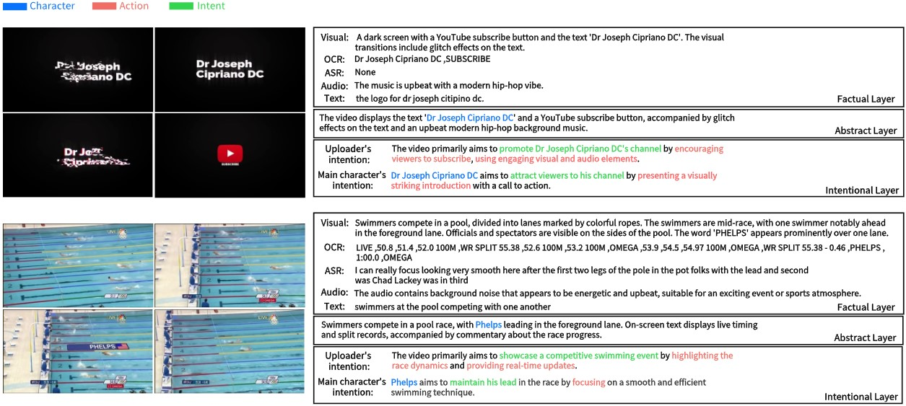

# VideoMind: An Omni-Modal Video Dataset with Intent Grounding for Deep-Cognitive Video Understanding \[[Paper]()\]

# :fire: News
- We release the full version of the video annotation for VideoMind ([OpenDataLab](https://opendatalab.com/Dixin/VideoMind) | [HuggingFace](https://opendatalab.com/Dixin/VideoMind)). 
  
# :book: Introduction

### What is VideoMind?
VideoMind is a large-scale video-centric multimodal dataset that can be used to learn powerful and transferable text-video representations for video understanding tasks such as video question answering and video retrieval. 

<p align="center">

<font size=2 color="gray">Examples of video clips and and the corresponding factual layer, abstract layer and intentional layer in the proposed VideoMind dataset.</font>
</p>

### Data statistics

<p align="center">

<font size=2 color="gray">uploader intention tag</font>
</p>

<p align="center">

<font size=2 color="gray">character intention tag</font>
</p>

### Model Performance

# :arrow_down: Data & Model Zoo

### Download
You can download our video annotation from \[[OpenDataLab](https://opendatalab.com/Dixin/VideoMind) \| [HuggingFace](https://opendatalab.com/Dixin/VideoMind) \]

You can download the raw videos and original annotation from \[[InternVid](https://opendatalab.com/shepshep/InternVid) \].

## Citation
If you find this work useful for your research, please consider citing VideoMind. Your acknowledgement would greatly help us in continuing to contribute resources to the research community. 😊
```
@inproceedings{,
  title={},
  author={},
  booktitle={},
  year={}
}
```

